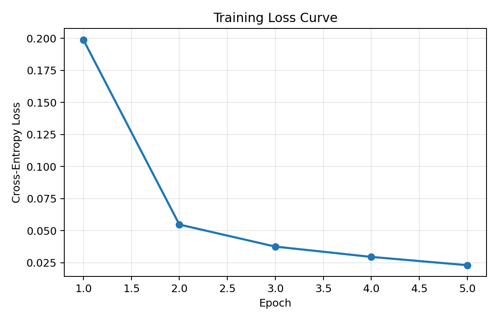
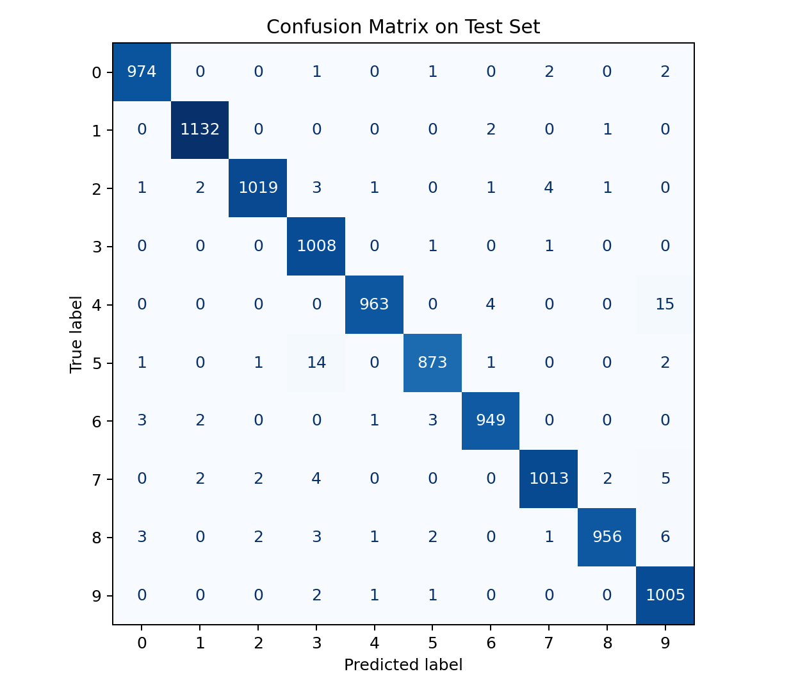
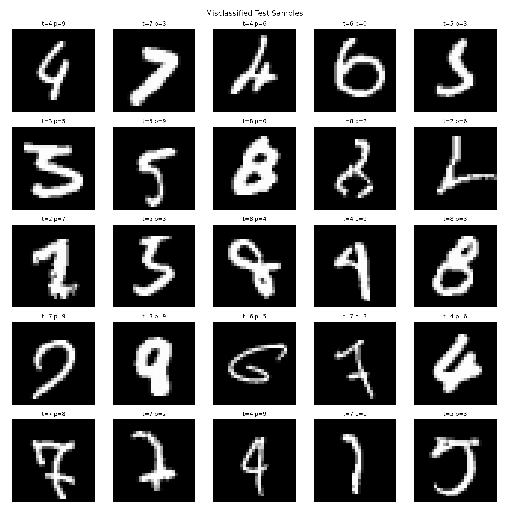

# MNIST Handwritten Digit Classification

[](https://github.com/The-niceU/ml-final-mnist-cnn/actions/workflows/ci.yml)


基于 PyTorch 的 MNIST 手写数字分类课程项目，支持原始 IDX 数据加载、可复现实验流程、可视化结果生成与消融分析导出，可直接用于课程汇报和 GitHub 展示。

## 目录

- [项目概述](#项目概述)
- [核心特性](#核心特性)
- [项目结构](#项目结构)
- [环境安装](#环境安装)
- [数据准备](#数据准备)
- [快速开始](#快速开始)
- [实验结果](#实验结果)
- [结果图与报告资产生成](#结果图与报告资产生成)
- [消融实验](#消融实验)
- [测试与质量保障](#测试与质量保障)
- [学术说明](#学术说明)
- [发布建议](#发布建议)
- [致谢](#致谢)

## 项目概述

本项目面向机器学习课程期末大作业，目标是构建一个**规范、完整、可复现**的图像分类工程化实现。模型采用 CNN 结构，在 MNIST 数据集上进行 10 类手写数字识别，并提供：

- 标准训练与评估流程
- 训练损失曲线、混淆矩阵、错分样本可视化
- 学习率/批大小/轮数的消融实验表格

## 核心特性

- 原生读取本地 `IDX` 文件（`*.ubyte`）
- 基于 `PyTorch` 的 CNN 训练评估
- 输出 `Accuracy` 与 `Macro-F1`
- 结果一键导出为图表与表格
- 文档与脚本分离，便于课程汇报与仓库展示

## 项目结构

```text
.
├─ .github/workflows/ci.yml
├─ assets/figures/
│  ├─ loss_curve.png
│  ├─ confusion_matrix.png
│  └─ misclassified_samples.png
├─ data/
│  └─ MNIST/raw/
├─ results/
│  ├─ ablation_results.csv
│  ├─ ablation_results.md
│  └─ metrics_summary.txt
├─ src/mnist_project/
│  ├─ cli.py
│  ├─ data.py
│  ├─ engine.py
│  └─ model.py
├─ tools/generate_report_artifacts.py
├─ tests/
├─ mnist_final_cpu.py
├─ REPORT.md
├─ README.md
├─ requirements.txt
└─ pyproject.toml
```

## 环境安装

推荐 Python 版本：`3.9+`

```bash
pip install -r requirements.txt
pip install -e .
```

## 数据准备

将以下文件放入 `data/MNIST/raw/`：

- `train-images-idx3-ubyte`
- `train-labels-idx1-ubyte`
- `t10k-images-idx3-ubyte`
- `t10k-labels-idx1-ubyte`

> 提示：`*.gz` 是压缩包，`*.ubyte` 是解压后的原始文件；本项目直接读取 `*.ubyte`。

## 快速开始

### 标准实验（CPU）

```bash
python -m mnist_project.cli --data-root data/MNIST/raw --device cpu --runs 5 --epochs 5
```

### 快速自检（低耗时）

```bash
python -m mnist_project.cli --data-root data/MNIST/raw --device cpu --runs 1 --epochs 1 --quick-train-samples 2000 --quick-test-samples 1000
```

### 兼容入口

```bash
python mnist_final_cpu.py --data-root data/MNIST/raw
```

## 实验结果

以下为当前仓库已生成的主实验结果（见 `results/metrics_summary.txt`）：

| 指标          |   数值 |
| ------------- | -----: |
| Accuracy      | 0.9892 |
| Macro-F1      | 0.9891 |
| Epochs        |      5 |
| Batch Size    |     64 |
| Learning Rate |  0.001 |

## 结果图与报告资产生成

通过脚本 `tools/generate_report_artifacts.py` 可自动生成：

1. 训练损失曲线（Loss Curve）
2. 测试集混淆矩阵（Confusion Matrix）
3. 错分样本可视化（Misclassified Cases）
4. 消融实验结果（CSV + Markdown）

### 推荐命令（完整实验）

```bash
python tools/generate_report_artifacts.py --data-root data/MNIST/raw --device cpu --epochs 5 --batch-size 64 --ablation-lrs 0.001,0.0005 --ablation-batches 32,64 --ablation-epochs 3,5
```

### 快速命令（检查流程）

```bash
python tools/generate_report_artifacts.py --data-root data/MNIST/raw --device cpu --epochs 1 --train-samples 2000 --test-samples 1000 --ablation-lrs 0.001 --ablation-batches 64 --ablation-epochs 1
```

### 生成产物路径

- `assets/figures/loss_curve.png`
- `assets/figures/confusion_matrix.png`
- `assets/figures/misclassified_samples.png`
- `results/ablation_results.csv`
- `results/ablation_results.md`
- `results/metrics_summary.txt`

### 可视化展示

#### 1) 训练损失曲线



#### 2) 测试集混淆矩阵



#### 3) 错分样本可视化



## 消融实验

消融实验原始结果见 `results/ablation_results.md`。当前最优组合为：

| learning_rate | batch_size | epochs | accuracy | f1_macro |
| ------------: | ---------: | -----: | -------: | -------: |
|        0.0005 |         64 |      5 |   0.9908 |   0.9907 |

## 测试与质量保障

```bash
pytest -q
```

GitHub Actions 已配置为 `main` 分支自动执行测试流程。

## 学术说明

- `说明.ipynb`、`说明.txt` 为课程教师提供说明材料。
- 本仓库中的工程化实现、可视化脚本、结果文档与报告文件为作者个人完成内容。

## 致谢

- MNIST dataset: Yann LeCun et al.
- Course staff for assignment guidance and baseline materials.
